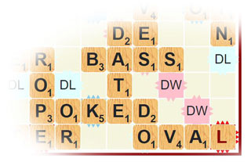
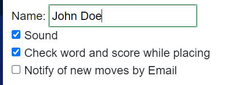

# Scrabble
 

A Blazor implementation of the classic word game with features:
 * Playing a game of 2-4 players across the Internet either in real time or asynchronously with Email notification.
 * Support playing on web browsers including Mobile with drag and drop tile manipulation.
 * Full implementation of the traditional board game following all the rules when possible.  A departure from tradition is that the opening
 tile draw only happens with player VS computer.  The player who creates a new game makes the opening move.
 * Immediate feedback when placing tiles for a move to confirm valid word(s) and valid placement

## Getting started
The application was developed using Visual Studio 2022 with .NET 8 and Blazor.  Before it can be run, the databases must be
created by running this command in the "Package Manager Console" (Select ScrabbleServer as the Default Project):
``` 
Update-Database -Context "ApplicationDbContext"
Update-Database -Context "ScrabbleDbContext" 
Update-Database -Context "MyKeysContext"
```
The first user to register is created as the administrator, along with the computer player.   The computer can
then be challenged for the first game.

The application is configured to use mssqllocaldb but could be redirected to other SQL databases.

## Note that 1.0.1 requires a 3rd Update-Database statement above for local keys storage

 ## Drag and Drop
 Drag and drop is mostly self explanatory but some helpful behavior:
 * Drop a tile on another tile to send it back to the tile rack (unless that tile has already been played)
 * Double click a tile in play on board to send it back to the rack.

 ## Player settings
    
 * Sound can be turned off to avoid disturbing those nearby
 * Check word: loads the entire word list dictionary to use for word validation and scoring.  Adds 5-10 seconds to game load time 
 and takes more memory in the browser.
 * If selected, Email notifications are only sent to the next player if they are not currently logged into that game.

 ## Player Admin
 Unruly players can be disabled from the player admin by unchecking the "Player" option


 ## Program configuration options

   ### Optional Notification Emails
 Email is used in the authentication process to confirm email validity, ownership, and allow user password resets.
 To enable notification Emails, identify your email server credentials and create the following entries with your server information by right-clicking on Scrabble.Server 
 and "Manage user secrets", then enter the information for the Email server:
 created by running this command in the "Package Manager Console" (Select ScrabbleServer as the Default Project):
``` 
  "AuthMessageSenderOptions:EmailEnabled": "true",
  "AuthMessageSenderOptions:SenderEmail": "johndoe@example.com",
  "AuthMessageSenderOptions:SenderName": "Scrabble Game",
  "AuthMessageSenderOptions:SmtpUsername": "johndoe@example.com",
  "AuthMessageSenderOptions:SmtpPort": "587",
  "AuthMessageSenderOptions:SmtpAppKey": "xxxxxxxxxxxxxxxx",
  "AuthMessageSenderOptions:SmtpHost": "smtp.example.com"
``` 
__Note:__ Gmail does not issue app keys unless strong 2-factor authentication is enabled (with hardware security key)  

After the email service is configured, edit the project file Scrabble\Scrabble\Server\Areas\Identity\Pages\Account\RegisterConfirmation.cshtml.cs
and comment out line 64:  ```DisplayConfirmAccountLink = true;```


 ### Optional "Google" log in button

 To add the option button to log in by Google, obtain an "OAUTH 2.0 Client ID" from Google's cloud services and enter
 keys into the user secrets file:
``` 
  "Authentication:Google:ClientId": "xxxxx..................xxxx.apps.googleusercontent.com",
  "Authentication:Google:ClientSecret": "xxxxxx-xxxxxxxxxxxxxx"
``` 
 ## Layout
 The program should adapt to web browsers all the way from from desktop to mobile.  On mobile the game is best played in portrait mode 
 and has not been adapted to landscape mode.


## The Dictionary

The dictionary is the North American Tournament Word List (TWL) from https://www.wordgamedictionary.com/twl06/ .  I added
several hundred words to this list based on new official Scrabble words announced in late 2022 as well as previously known words 
in a Scrabble dictionary but not on the list. The TWL contains approximately 179,000 English Scrabble words.

An alternative European English dictionary is SOWPODS.txt from https://www.wordgamedictionary.com/sowpods/

## Not Implemented
* Offline play against computer.   Although the game definition and dictionary can reside locally, this is 
currently not implemented.
* Offline play of active game(s) which will post the move(s) when reconnected.
* Optimized computer algorithms with multiple difficulty levels.
* Player performance tallies.  (Currently completed games are purged after 30 days)
* Algorithm such as outlined at https://www.cs.cmu.edu/afs/cs/academic/class/15451-s06/www/lectures/scrabble.pdf


## 2024 Upgrde to DotNet 8

I still play the game every day with a small group.   The upgrade to .NET 8 goal was to integrate the new Identity system and become familiar
with the .NET 8 render modes by creating the project new from .NET 8 templates.  There is little or no user experience improvement.  I made some bad design choices, so there are some imacts
on upgrading to this code base.   I'll probably fix things for a general purpose proper upgrade with DotNet 9.

* In Program.cs (both client and server), change  __BaseAddress = new Uri("https://www.scrabble.example.com")__ to the deployed server name.
* Apply database migrations for new Identity layout:  __Update-Database -Context "MyKeysContext"__
* Browsers tend to cache the .NET 7 Webassembly page: the first time a player loads the .NET 8 site, there's a good chance they'll see
the spinning loading circle and nothing else.   A SHIFT + reload button or clearing web page cache should correct this.
* External Google logins are now saved across browser load by default.  The proper fix is a "Remember Me" checkbox being applied to 
that setting, but that's a complicated fix with the render model on the login page.


# Credits

## Sounds

  * Incoming tiles: <a href="https://freesound.org/people/zerolagtime/sounds/89801/">rock_drop-nuts#3.flac</a> by <a href="https://freesound.org/people/zerolagtime/">zerolagtime</a> | License: Attribution 3.0</li>
  * Game Over:  <a href="https://freesound.org/people/Fupicat/sounds/607207/">Congrats</a> by <a href="https://freesound.org/people/Fupicat/">Fupicat</a> | License: Creative Commons 0</li>
  * Move accepted:  <a href="https://freesound.org/people/actsofpaint/sounds/371088/">EllenGuitarTada1.wav</a> by <a href="https://freesound.org/people/actsofpaint/">actsofpaint</a> | License: Attribution 3.0</li>
  * Move disallowed: <a href="https://freesound.org/people/DExUS5/sounds/392183/">NEGATIVE.wav</a> by <a href="https://freesound.org/people/DExUS5/">DExUS5</a> | License: Creative Commons 0</li>
  * Incoming Chat: <a href="https://freesound.org/people/InspectorJ/sounds/345687/">Comedic Whistle, B.wav</a> by <a href="https://freesound.org/people/InspectorJ/">InspectorJ</a> | License: Attribution 4.0</li>

## Other
* Tile Bag designed by Bart Michaels at https://github.com/bartmichels/scrabble
* Scrabble in Blazor for inspiration and some ideas https://github.com/ddashwood/Scrabble
* Sharpscrabble https://code.google.com/archive/p/sharpscrabble/  <- For writeup of the word dictionary.
	* Sharpscrabble SVN code imported to https://github.com/vbasarkar/sharpscrabble

